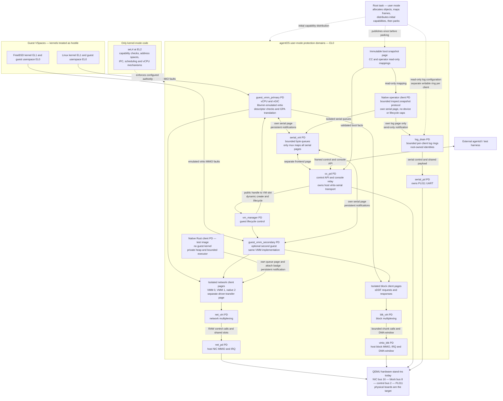
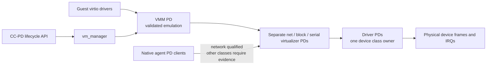

# agentOS architecture and security boundaries

agentOS puts device ownership, I/O multiplexing, and guest execution in
separate seL4 user-mode protection domains (PDs). Linux and FreeBSD consume
devices emulated by agentOS. Their kernels do not own the host NIC, disk, or
UART. A native Rust PD now uses the network virtualizer directly, with an
isolated queue page and target-qualified coexistence with Ubuntu.

This diagram describes the AArch64 topology after the direct CC-to-VM-manager
lifecycle change (`task_d2cfd8f55cb64e4b91e4c45ead3df6f7`). It is an implementation snapshot,
not evidence of bare-metal or x86 guest qualification. Solid arrows show
current paths; dashed arrows show bootstrap authority or planned paths.

## Current device and control paths

The diagram omits auxiliary nameserver/fault-handler PDs and compatibility
`block_pd` from the I/O paths. The generated system descriptor and manifest
remain the complete topology authority. A second VMM is included only in image
variants that configure it. The native PD appears only in the native test
image; ordinary images do not include it.

## How the approach differs

| Design decision | agentOS mechanism | Security consequence and limit |
| --- | --- | --- |
| A workload OS does not own the machine's devices | Guest virtio MMIO faults into a VMM; only designated driver PDs receive host device frames and IRQs | A compromised guest cannot simply program the host device. It can still attack its VMM's parser and virtual-device implementation. |
| Drivers execute outside the kernel | Driver PDs have separate VSpaces and explicit capabilities | A driver bug does not inherently gain kernel execution. Its granted device/DMA authority still matters; this is not an IOMMU isolation proof. |
| Multiplexing is a service boundary | Separate `net_virt`, `blk_virt` and `serial_virt` PDs consume bounded queues | Device access crosses a named service boundary. VMM client pages are isolated; resource exhaustion still requires auditing. |
| A guest address is not a host pointer | VMM code validates descriptors and translates GPA to its mapped guest RAM | Invalid descriptors can be rejected before copying. Correctness of every translation and length calculation remains userspace TCB work. |
| Native work need not inherit a Linux kernel | A no_std Rust PD uses the canonical network queues with scoped attach and notification capabilities | Native ARP exchanges interleaved with guest pings passed after Ubuntu SSH provisioning. This qualifies raw queue access and coexistence, not a production TCP/IP stack. |
| Inspection need not acquire new runtime authority | Root publishes immutable boot observations through a read-only CC mapping | A target fault probe verifies that CC cannot write this page. The report does not expose root capabilities or claim live thread state. The existing CC socket remains a privileged control channel; the read-only operation is not a separate authorization boundary. |
| A native observation client can omit lifecycle authority | `operator_session` has its own serial page and read-only snapshot, with no guest-memory, driver or lifecycle caps | Seven target fault probes reject guest/CC page accesses and snapshot writes. This confines the operator; it does not reduce the existing CC transport's control authority. |
| Diagnostic identities need not be chosen by the writer | Root provisions separate log rings and read-only identities; `log_drain` validates cursors and preserves per-client partial lines | A producer cannot select another client's configured identity through the logging API. It can still emit false statements under its own identity, fill its ring and consume CPU. Logs are not authorization evidence. |
| Control and bulk data have different contracts | seL4 IPC for attach/lifecycle; shared-memory queues for net/block/console payloads | Root-minted badges constrain attachment. Console queues and descriptor progress remain bounded; shared metadata does not grant lifecycle authority. The sustained-output target proof recovered 262,144 bytes after backpressure; scope and evidence are detailed in TCB.md. |

These choices differ from a host-kernel driver path and from assigning a host
device directly to a guest. They are not a claim that every other hypervisor
uses either design or that capability-based virtualization is unique to
agentOS.

## The compromise boundary is explicit

Guest compromise and VMM compromise are different threats. Guest kernels do
not receive the host sDDF queue mappings. Their VMMs do. At this revision the
root maps each VMM's network and block client onto separate 2 MB frames; each
VMM maps only its own client frames. net_pd maps only a separate transfer page,
which net_virt also maps. `make test-network-isolation` verifies foreign-client
and driver-page read/write faults from both VMM slots. Block
clients occupy separate 2 MB frames, and each VMM maps only its own frame.
The virtualizer alone maps all block client frames and the RAM-disk page.
`make test-block-isolation` checks read/write faults from both VMM slots at
foreign block-client and RAM-disk addresses. Each class is qualified separately.

Device selection is independently capability-bound. Root mints each VMM's
net/block endpoint with its assigned slot badge; ATTACH checks that badge
against the requested client, VMM slot, and block media before changing state
or calling a driver. `make test-virtualizer-authority` rejects spoofed
attachments from both VMM slots and then accepts their legitimate assignments.
This closes the request-based media-selection gap independently of the page
mapping boundaries.

Serial contract v2 separates four client pages: primary VMM 0, secondary VMM 1,
native operator 2 and CC frontend 3. Each client maps its own page; only
`serial_virt` maps all four. The operator's observation page is separately
read-only. This distinguishes compromise of a console client from compromise
of the mux, which retains access to every serial client's data.

Logging has a separate mapping boundary. Each AArch64 client maps one 4 KiB
ring; only `log_drain` maps the combined ring region. Root retains frame caps
and supplies read-only configuration. A send-only notification wakes the drain
without granting access to its other rings. Native probes first log normally,
then fault on reads/writes to the drain region and writes to configuration.
These tests establish the probed access restrictions, not truthful messages,
lossless delivery or fair service under a malicious producer's load.

The root task, VMMs, virtualizers, and drivers therefore remain consequential
TCB components. seL4 enforces the authority they are given; its verification
does not prove the correctness of agentOS C/Rust code, the generated capability
policy, device firmware, QEMU, or all hardware configurations. Availability,
side channels, malicious DMA, and recovery need their own evidence.

## Target topology and remaining work

Network, block and console now have separate virtualizer boundaries. The
Ubuntu console gate proves transfer through `serial_virt` and echoed guest
input. The dual-guest test also passed concurrent Ubuntu/FreeBSD authenticated
SSH and FreeBSD suspend/resume; the tested image is identified in `TCB.md`.
Destroyed slots cannot yet be recreated in the same image. Dynamic lifecycle
calls `vm_manager` directly; `vibe_engine` is retired from the image.
The native Rust network client also passed ten fault probes denying reads and
writes to both guest queue pages, driver transfers, NIC MMIO and driver DMA.
The combined Ubuntu/native image and its three fresh traffic rounds are
identified in `TCB.md`. Other native device classes, physical boards, and x86
guest execution require independent target evidence.

## Evidence and source map

| Claim or boundary | Authority |
| --- | --- |
| Booted PDs, endpoints and device assignments | [`system_desc_aarch64.c`](../kernel/agentos-root-task/src/system_desc_aarch64.c), [`agentos.toml`](../kernel/agentos-root-task/agentos.toml) |
| Shared network/block mapping rights | [`main.c`](../kernel/agentos-root-task/src/main.c), block and network mapping branches in the PD spawn path |
| Allowed device owners and qualification limits | [`TCB.md`](TCB.md) |
| Network and block queue contracts | [`platform/include/platform/`](../platform/include/platform/), [`contracts/`](../kernel/agentos-root-task/include/contracts/) |
| Guest-visible device proofs | `make gate`: host tests, both stub-boot architectures, guest net/block/console proofs |
| Native runtime, denied mappings, and live guest coexistence | `make test-native-rust`, `make test-native-network-isolation`, `make test-native-with-guest`; exact image and scope in [`TCB.md`](TCB.md) |
| Concurrent authenticated Linux/FreeBSD acceptance | `make demo-test` passed at `d3da13e1`; retained image hash and qualification scope in [`TCB.md`](TCB.md) |
| Release-level claims | [`RELEASES.md`](RELEASES.md): exact revision, gate receipt, checksums and remote verification |

The detailed diagram is an evidence-backed snapshot, not a generated
capability audit. Refresh it and the [presentation claim ledger](presentations/agentos-systems-security/FACTS.md)
when topology or qualification changes.
