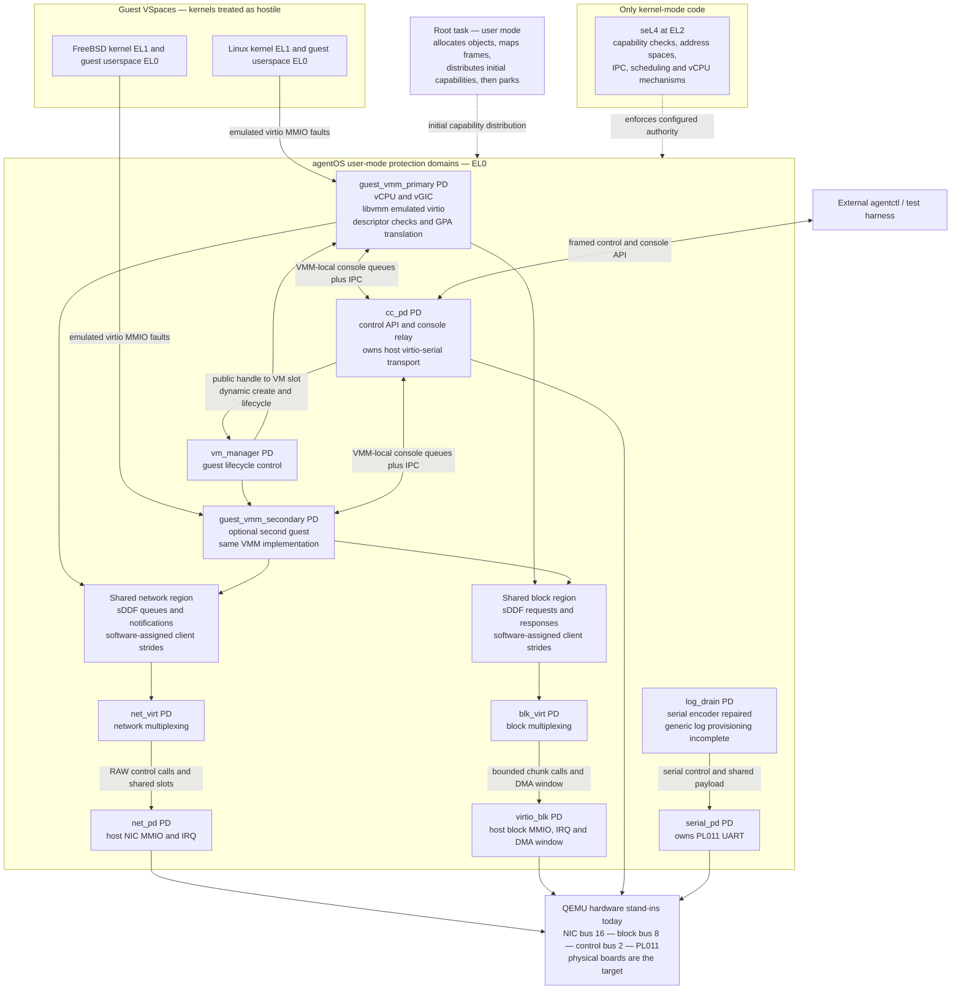
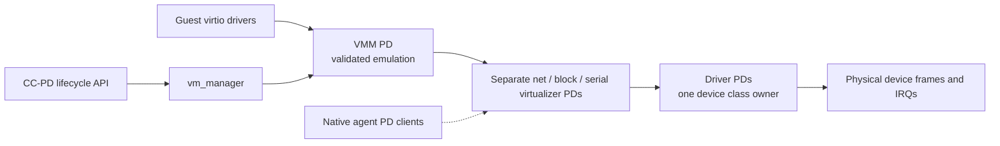

# agentOS architecture and security boundaries

agentOS puts device ownership, I/O multiplexing, and guest execution in
separate seL4 user-mode protection domains (PDs). Linux and FreeBSD consume
devices emulated by agentOS. Their kernels do not own the host NIC, disk, or
UART. Native agents are intended to use the same virtualizers directly.

This diagram describes the AArch64 topology after the direct CC-to-VM-manager
lifecycle change (`task_d2cfd8f55cb64e4b91e4c45ead3df6f7`). It is an implementation snapshot,
not evidence of bare-metal or x86 guest qualification. Solid arrows show
current paths; dashed arrows show bootstrap authority or planned paths.

## Current device and control paths

The diagram omits auxiliary nameserver/fault-handler PDs and compatibility
`block_pd` from the I/O paths. The generated system descriptor and manifest
remain the complete topology authority. A second VMM is included only in image
variants that configure it.

## How the approach differs

| Design decision | agentOS mechanism | Security consequence and limit |
| --- | --- | --- |
| A workload OS does not own the machine's devices | Guest virtio MMIO faults into a VMM; only designated driver PDs receive host device frames and IRQs | A compromised guest cannot simply program the host device. It can still attack its VMM's parser and virtual-device implementation. |
| Drivers execute outside the kernel | Driver PDs have separate VSpaces and explicit capabilities | A driver bug does not inherently gain kernel execution. Its granted device/DMA authority still matters; this is not an IOMMU isolation proof. |
| Multiplexing is a service boundary | Separate `net_virt` and `blk_virt` PDs consume bounded queues | Device access crosses a named service boundary. Shared-region mapping and resource exhaustion still require auditing. |
| A guest address is not a host pointer | VMM code validates descriptors and translates GPA to its mapped guest RAM | Invalid descriptors can be rejected before copying. Correctness of every translation and length calculation remains userspace TCB work. |
| Native work need not inherit a Linux kernel | Native PD clients are planned to attach to canonical virtualizers | The architecture can remove an entire guest kernel from a workload's dependency set. Live native virtualizer attachment is not yet qualified. |
| Control and bulk data have different contracts | seL4 IPC for attach/lifecycle; shared-memory queues for net/block payloads | Authority checks and data movement have explicit boundaries. Console still needs migration to a separate virtualizer PD. |

These choices differ from a host-kernel driver path and from assigning a host
device directly to a guest. They are not a claim that every other hypervisor
uses either design or that capability-based virtualization is unique to
agentOS.

## The compromise boundary is explicit

Guest compromise and VMM compromise are different threats. Guest kernels do
not receive the host sDDF queue mappings. Their VMMs do. At this revision the
root maps each VMM's network and block client onto separate 2 MB frames; each
VMM maps only its own client frames. net_pd maps only a separate transfer page,
which net_virt also maps. `make test-network-isolation` verifies foreign-client
and driver-page read/write faults from both VMM slots. Block
clients occupy separate 2 MB frames, and each VMM maps only its own frame.
The virtualizer alone maps all block client frames and the RAM-disk page.
`make test-block-isolation` checks read/write faults from both VMM slots at
foreign block-client and RAM-disk addresses. Each class is qualified separately.

Device selection is independently capability-bound. Root mints each VMM's
net/block endpoint with its assigned slot badge; ATTACH checks that badge
against the requested client, VMM slot, and block media before changing state
or calling a driver. `make test-virtualizer-authority` rejects spoofed
attachments from both VMM slots and then accepts their legitimate assignments.
This closes the request-based media-selection gap independently of the page
mapping boundaries.

The root task, VMMs, virtualizers, and drivers therefore remain consequential
TCB components. seL4 enforces the authority they are given; its verification
does not prove the correctness of agentOS C/Rust code, the generated capability
policy, device firmware, QEMU, or all hardware configurations. Availability,
side channels, malicious DMA, and recovery need their own evidence.

## Target topology and remaining work

Network and block already have the separate virtualizer boundary. Console is
still a library inside each VMM. Dynamic lifecycle now calls `vm_manager`
directly; `vibe_engine` is retired from the image. Separating `serial_virt`
and attaching native clients remain implementation tasks. Physical
board execution and x86 guest execution require independent target evidence.

## Evidence and source map

| Claim or boundary | Authority |
| --- | --- |
| Booted PDs, endpoints and device assignments | [`system_desc_aarch64.c`](../kernel/agentos-root-task/src/system_desc_aarch64.c), [`agentos.toml`](../kernel/agentos-root-task/agentos.toml) |
| Shared network/block mapping rights | [`main.c`](../kernel/agentos-root-task/src/main.c), block and network mapping branches in the PD spawn path |
| Allowed device owners and remaining console gap | [`TCB.md`](TCB.md) |
| Network and block queue contracts | [`platform/include/platform/`](../platform/include/platform/), [`contracts/`](../kernel/agentos-root-task/include/contracts/) |
| Guest-visible device proofs | `make gate`: host tests, both stub-boot architectures, guest net/block/console proofs |
| Concurrent authenticated Linux/FreeBSD acceptance | `make demo-test`; remains under qualification after the retained FreeBSD SSH timeout |
| Release-level claims | [`RELEASES.md`](RELEASES.md): exact revision, gate receipt, checksums and remote verification |

The detailed diagram is an evidence-backed snapshot, not a generated
capability audit. Refresh it and the [presentation claim ledger](presentations/agentos-systems-security/FACTS.md)
when topology or qualification changes.
